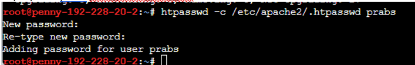
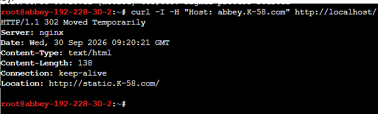
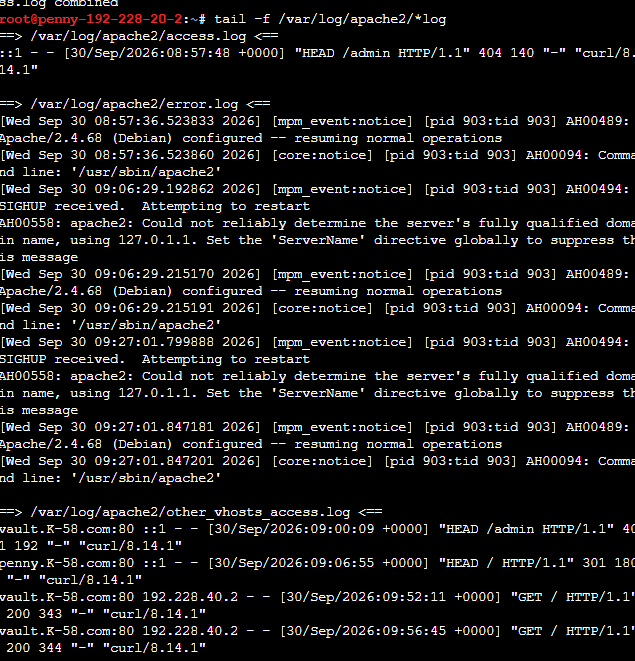
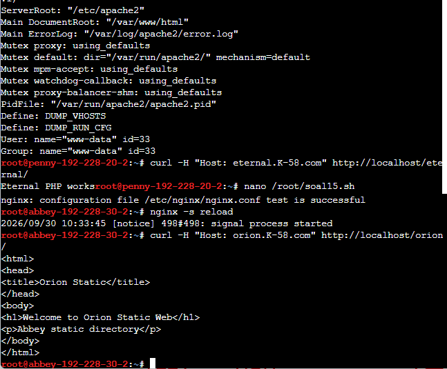
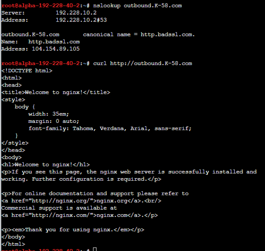
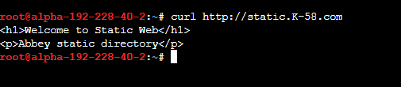

# Jaringan Komputer – Modul 2
# Laporan Praktikum Jaringan Komputer - Modul 1 (The Mesh)

**Repository ini berisi laporan pengerjaan praktikum infrastruktur jaringan berbasis GNS3 dan Docker, mencakup konfigurasi Routing, DNS Server, Web Server Statis, dan Web Server Dinamis.**

---

## Soal 1 — Perancangan Topologi Fisik

**Tujuan:** Mendesain infrastruktur fisik jaringan ("The Mesh") di dalam GNS3 dengan membagi node ke dalam 5 area/segmen berbeda yang berpusat pada satu router utama (`rootkit`).

### Langkah Pengerjaan

1. Tarik node Docker dari daftar *appliance* GNS3 ke dalam *workspace*.
2. Kelompokkan node ke dalam 5 area yang terhubung melalui *switch* perantara:
   * **Segmen 10 (Server Inti & Web):** `prab`, `tedd`, `obladi`, `desmond`, `oblada`, `molly`.
   * **Segmen 20 (Gerbang www):** `penny`.
   * **Segmen 30 (Gerbang static):** `abbey`.
   * **Segmen 40 (Klien Kiri):** `alpha`, `beta`, `gamma`.
   * **Segmen 50 (Klien Kanan):** `delta`, `epsilon`.
3. Hubungkan semua *switch* dari tiap segmen ke antarmuka (*interface*) Ethernet yang berbeda pada router `rootkit`.

>
> ``

### Analisis

- Pembagian ke dalam 5 segmen fisik terpisah menggunakan *switch* yang berbeda bertujuan untuk memecah *broadcast domain*. Ini mengisolasi lalu lintas jaringan internal tiap area agar tidak membebani area lain.
- Router `rootkit` bertindak sebagai titik pusat (*star topology* secara makro), yang berarti kegagalan pada satu segmen klien tidak akan memutus koneksi di segmen server, namun jika `rootkit` mati, seluruh komunikasi lintas-segmen akan terputus.

---

## Soal 2 — Perancangan Topologi Logis (Skema Pengalamatan IP)

**Tujuan:** Menentukan blok alamat IP (Network ID) dan mengalokasikan IP statis beserta *prefix* subnet untuk masing-masing segmen jaringan.

### Langkah Pengerjaan

1. Tetapkan *Network ID* dasar berdasarkan pembagian segmen:
   * Segmen 10: `192.228.10.0/24`
   * Segmen 20: `192.228.20.0/24`
   * Segmen 30: `192.228.30.0/24`
   * Segmen 40: `192.228.40.0/24`
   * Segmen 50: `192.228.50.0/24`
2. Alokasikan IP pertama (`.1`) dari setiap subnet untuk digunakan sebagai *Gateway* pada router `rootkit`.
3. Ubah nama (*rename*) node di GNS3 agar menyertakan alamat IP menggunakan tanda hubung untuk memudahkan identifikasi tanpa melanggar aturan nama *container* Docker (Contoh: `prab` menjadi `prab-192-228-10-2`).

> 

### Analisis

- Penggunaan *prefix* `/24` (Subnet Mask `255.255.255.0`) menyediakan hingga 254 *host* yang dapat digunakan per segmen. Ini lebih dari cukup untuk kebutuhan topologi *The Mesh* sekaligus memberikan ruang ekspansi jika ada penambahan *node* di masa depan.
- Aturan penamaan IP langsung pada *hostname* visual GNS3 (tanpa menggunakan karakter `[` atau `.`) menghindari *error invalid name* dari *daemon* Docker di latar belakang.

---

## Soal 3 — Konfigurasi Antarmuka Router (`rootkit`)

**Tujuan:** Mengaktifkan antarmuka jaringan pada router sentral (`rootkit`) dan memasang IP *Gateway* agar router dapat merutekan paket antar-subnet.

### Langkah Pengerjaan

1. Buka terminal/console pada node **`rootkit-192-228-10-1`**.
2. Masukkan IP untuk tiap *interface* (`eth0` hingga `eth4`) yang terhubung ke switch segmen terkait.
3. Nyalakan antarmuka jaringan dengan perintah `ip link set up`.

> 

### Hasil Konfigurasi

| Interface | Terhubung Ke | IP Address (Gateway) |
|---|---|---|
| `eth0` | Segmen 10 (Server) | `192.228.10.1/24` |
| `eth1` | Segmen 20 (Penny) | `192.228.20.1/24` |
| `eth2` | Segmen 30 (Abbey) | `192.228.30.1/24` |
| `eth3` | Segmen 40 (Klien Kiri) | `192.228.40.1/24` |
| `eth4` | Segmen 50 (Klien Kanan) | `192.228.50.1/24` |

### Analisis

- Setelah IP dikonfigurasi, tabel *routing* lokal pada `rootkit` akan otomatis terisi rute dengan status *Directly Connected* (C).
- Oleh karena semua subnet langsung menempel secara fisik pada `rootkit`, kita tidak perlu repot menyetel protokol *routing* dinamis (seperti OSPF atau RIP) maupun *static route* manual.

---

## Soal 4 — Inisialisasi Server Inti (DNS)

**Tujuan:** Mengonfigurasi IP statis secara spesifik pada node yang akan bertindak sebagai Master dan Slave DNS (`prab` dan `tedd`) sebagai persiapan sebelum mengatur *resolver* DNS masal di klien.

### Langkah Pengerjaan

1. Buka terminal **`prab-192-228-10-2`** (Master DNS) dan atur IP `192.228.10.2/24` beserta *default gateway* ke `192.228.10.1`.
2. Buka terminal **`tedd-192-228-10-3`** (Slave DNS) dan atur IP `192.228.10.3/24` beserta *default gateway* ke `192.228.10.1`.

> 
> 

### Analisis

- Server DNS mutlak membutuhkan IP Statis. Jika IP mereka berubah-ubah (DHCP), seluruh node klien di segmen lain akan kehilangan arah karena file `/etc/resolv.conf` mereka mengarah ke IP yang salah, membuat resolusi nama domain lumpuh total.

---

## Soal 5 — Konfigurasi Klien Masal (Script `soal5.sh`)

**Tujuan:** Memberikan IP address, mendefinisikan *default gateway*, dan menetapkan DNS *Resolver* secara otomatis dan seragam pada seluruh node klien dan *web server* yang tersisa.

### Langkah Pengerjaan

1. Buat file script bash pada setiap node klien (contoh di bawah adalah untuk node `alpha` di segmen 40):
   ```bash
   cat > /root/soal5.sh << 'EOF'
   #!/bin/bash
   ip addr flush dev eth0
   ip addr add 192.228.40.2/24 dev eth0
   ip link set eth0 up
   ip route add default via 192.228.40.1
   echo "nameserver 192.228.10.2" > /etc/resolv.conf
   echo "nameserver 192.228.10.3" >> /etc/resolv.conf
   EOF
---
## Soal 6 — Pengujian Routing Lintas Segmen (The Mesh)

**Tujuan:** Memvalidasi konfigurasi pengalamatan IP statis dan Gateway pada seluruh node (hasil dari Soal 1 hingga 5) dengan melakukan pengiriman paket ICMP (*ping*) melintasi router utama menuju segmen jaringan yang berbeda.

### Langkah Pengerjaan

1. Buka terminal pada salah satu node klien, misalnya **`alpha`** (`192.228.40.2`).
2. Lakukan pengujian konektivitas secara bertahap mulai dari gateway terdekat hingga ke node di segmen terjauh:
   ```bash
   # 1. Tes koneksi ke router (Gateway segmen 40)
   ping -c 3 192.228.40.1
   
   # 2. Tes koneksi ke area Server Web (Segmen 10)
   ping -c 3 192.228.10.4
   
   # 3. Tes koneksi ke area Klien seberang (Segmen 50)
   ping -c 3 192.228.50.2
---
## Soal 6 — Pengujian Konektivitas Inter-VLAN/Subnet

### Hasil Pengujian

| Target | Ping IP Tujuan | Hasil |
|--------|---------------|-------|
| Gateway Lokal | `192.228.40.1` | ✅ Reply (64 bytes from 192.228.40.1) |
| Server `obladi` | `192.228.10.4` | ✅ Reply (64 bytes from 192.228.10.4) |
| Klien `delta` | `192.228.50.2` | ✅ Reply (64 bytes from 192.228.50.2) |

### Analisis

- Respons **Reply** pada seluruh pengujian memvalidasi bahwa tabel routing pada router sentral (`rootkit`) telah beroperasi dengan baik untuk merutekan lalu lintas Inter-VLAN/Subnet.
- Pada pengujian lintas segmen, terlihat adanya pengurangan nilai **TTL (Time to Live)** pada paket balasan (biasanya menjadi `63`). Ini mengonfirmasi bahwa paket data secara fisik telah melewati setidaknya satu hop router jaringan.
- Keberhasilan di **Layer 3 (Network Layer)** ini merupakan prasyarat mutlak sebelum mengonfigurasi layanan berbasis domain dan web (**Layer 7**).

---

## Soal 7 — Forward DNS, Load Balancing & CNAME

**Tujuan:** Mengonfigurasi BIND9 Master di node `prab` untuk menerjemahkan nama domain `K-58.com` ke IP (Forward Lookup), membagi beban lalu lintas HTTP ke beberapa server web (Load Balancing), serta membuat alias domain (CNAME).

### Langkah Pengerjaan

**1.** Masuk ke terminal `prab` dan modifikasi file konfigurasi zona forward `/etc/bind/db.K-58.com`.

**2.** Tambahkan pemetaan *Multiple A Record* untuk domain `vault` dan `core`, serta CNAME untuk alias:

```dns
; Multiple A Record (Load Balancing)
vault   IN      A       192.228.10.4
vault   IN      A       192.228.10.5

core    IN      A       192.228.10.6
core    IN      A       192.228.10.7

; Canonical Name (Alias)
www     IN      CNAME   penny.K-58.com.
static  IN      CNAME   abbey.K-58.com.
```

**3.** Restart layanan DNS BIND9 secara manual (untuk mengatasi limitasi runlevel Docker):

```bash
pkill named 2>/dev/null
named
```

**4.** Lakukan pengujian lookup dari klien `alpha`:

```bash
nslookup vault.K-58.com
nslookup www.K-58.com
```

<!-- Ganti path gambar sesuai lokasi file di repository -->


*Gambar 7.1 — Hasil resolusi domain `vault` dan `www`.*

### Hasil Pengujian

| Perintah Pengujian | Respons DNS BIND9 |
|--------------------|-------------------|
| `nslookup vault.K-58.com` | Menampilkan 2 buah IP sekaligus (`192.228.10.4` dan `192.228.10.5`) |
| `nslookup www.K-58.com` | Menampilkan canonical name `penny.K-58.com` (IP `192.228.20.2`) |

### Analisis

- **Load Balancing (Round-Robin):** Penugasan dua A Record pada satu hostname (`vault`) membuat BIND9 merespons kueri dengan menggilir urutan IP yang dikirim ke klien. Hal ini memungkinkan pendistribusian beban kerja agar tidak hanya berpusat pada satu web server.
- **CNAME:** Penggunaan Canonical Name menyederhanakan manajemen DNS. Domain `www` hanya berupa alias; jika IP asli dari node `penny` berubah suatu saat nanti, administrator tidak perlu mengubah data pada rekaman `www`.

---

## Soal 8 — Reverse DNS (PTR Record) di Master & Slave

**Tujuan:** Membangun Reverse Zone (`in-addr.arpa`) pada Master (`prab`) dan Slave (`tedd`) agar IP dari segmen 10, 20, dan 30 dapat diterjemahkan kembali (reverse lookup) menjadi hostname.

### Langkah Pengerjaan

**1. Konfigurasi Master (`prab`)**

Buat file `/etc/bind/db.10`, `db.20`, dan `db.30`, lalu isi dengan *Pointer Record (PTR)* berdasarkan oktet terakhir alamat IP. Contoh konfigurasi pada `db.10`:

```dns
2       IN      PTR     prab.K-58.com.
3       IN      PTR     tedd.K-58.com.
4       IN      PTR     obladi.K-58.com.
```

Daftarkan zona tersebut di `/etc/bind/named.conf.local` sebagai `type master`.

**2. Konfigurasi Slave (`tedd`)**

Daftarkan blok zona yang sama di file `/etc/bind/named.conf.local` pada node Slave, namun atur tipenya untuk menyalin dari Master:

```bind
zone "10.228.192.in-addr.arpa" { type slave; file "/var/cache/bind/db.10"; masters { 192.228.10.2; }; };
zone "20.228.192.in-addr.arpa" { type slave; file "/var/cache/bind/db.20"; masters { 192.228.10.2; }; };
```

**3.** Restart daemon `named` pada kedua node, lalu uji dari terminal klien:

```bash
nslookup 192.228.10.4
nslookup 192.228.20.2
```


*Gambar 8.1 — Hasil pengujian PTR Record.*

### Analisis

- **Zone Transfer** beroperasi secara otomatis. Node `tedd` mendeteksi parameter **Serial Number** pada SOA record di node `prab`. Ketika bernilai lebih tinggi, `tedd` menyalin seluruh data reverse zone ke dalam `/var/cache/bind/`.
- Resolusi `in-addr.arpa` ditulis **berlawanan arah** dengan IP biasa (contoh: segmen jaringan `192.228.10.0` dikelola dalam zona `10.228.192.in-addr.arpa`). Konfigurasi ini sangat krusial dalam jaringan riil untuk keperluan verifikasi mail server (anti-spam) dan pencatatan log aktivitas firewall.

---

## Soal 9 — Web Server Statis & Directory Listing (Autoindex)

**Tujuan:** Menginstal layanan web statis HTTP dengan **Apache2** pada node di area Vault (`obladi` dan `desmond`), dan memodifikasi VirtualHost agar direktori `/arsip/` dapat menampilkan struktur filenya secara otomatis.

### Langkah Pengerjaan

**1.** Pada terminal `obladi` dan `desmond`, instal Apache2 lalu buat direktori penyimpanan dan beberapa file dokumen dummy:

```bash
apt-get update && apt-get install -y apache2
mkdir -p /arsip
echo "Dokumen Rahasia 1" > /arsip/laporan.pdf
```

**2.** Modifikasi file konfigurasi `/etc/apache2/sites-available/000-default.conf` dengan menambahkan blok alias direktori di bawah `DocumentRoot`:

```apache
Alias /arsip /arsip
<Directory /arsip>
        Options Indexes FollowSymLinks
        AllowOverride None
        Require all granted
</Directory>
```

**3.** Jalankan proses latar belakang Apache menggunakan utilitas langsung karena container tidak memiliki PID 1 (systemd):

```bash
pkill apache2 2>/dev/null
apache2ctl -k start
```

**4.** Pengujian dari terminal `alpha`:

```bash
curl http://vault.K-58.com/arsip/
```


*Gambar 9.1 — Output HTML dari indeks direktori `/arsip/`.*

### Analisis

- Eksekusi layanan dilakukan melalui skema *bypass* (`apache2ctl`) untuk menghindari kegagalan inisiasi (`policy-rc.d denied`) dari infrastruktur Docker.
- Parameter `Options Indexes` pada Apache menginstruksikan server untuk bertindak sebagai fungsi **Autoindex**. Apabila path URL tersebut tidak menyimpan file utama seperti `index.html` atau `index.php`, Apache akan mengonversi daftar file/folder di dalamnya menjadi elemen list HTML yang dapat dibaca dan diakses oleh pengguna.

---

## Soal 10 — Web Dinamis, Load Balancing & Clean URL

**Tujuan:** Mengonfigurasi **Nginx** dan **PHP-FPM** di node Core (`oblada` dan `molly`) untuk merender halaman yang membaca identitas server secara dinamis (membuktikan DNS Round-Robin), dan menyamarkan akses ke skrip PHP menggunakan fitur **Clean URL**.

### Langkah Pengerjaan

**1.** Pada terminal `oblada` dan `molly`, instal seluruh paket dependensi Nginx dan PHP:

```bash
apt-get update && apt-get install -y nginx php-fpm php-common
```

**2.** Buat skrip web dinamis (`index.php` dan `profil.php`) di dalam `/var/www/html/` yang memanggil fungsi bawaan OS:

```php
<?php
echo "<h1>Welcome to Core Web - Node: " . gethostname() . "</h1>";
echo "<p>Halaman ini diakses dari server " . gethostname() . ".</p>";
?>
```

**3.** Ubah blok server Nginx pada `/etc/nginx/sites-available/default` dengan menambahkan aturan rewrite:

```nginx
location / {
    try_files $uri $uri/ $uri.php?$args;
}
```

**4.** Hubungkan socket Nginx dengan biner PHP secara manual tanpa layanan `systemctl`:

```bash
mkdir -p /run/php
PHP_BIN=$(ls /usr/sbin/php-fpm* | head -n 1)
$PHP_BIN -D 2>/dev/null
nginx
```

**5.** Verifikasi fungsionalitas dari klien `alpha`:

```bash
# Uji Load Balancing (jalankan beberapa kali)
curl http://core.K-58.com/

# Uji Clean URL (tanpa menyertakan .php)
curl http://core.K-58.com/profil
```


*Gambar 10.1 — Eksekusi URL dinamis dan Clean URL.*

### Hasil Pengujian

| Skenario Pengujian | Target URL | Output Rendering Halaman |
|--------------------|-----------|--------------------------|
| Eksekusi 1 | `http://core.K-58.com/` | Welcome to Core Web - Node: `molly-192-228-10-7` |
| Eksekusi 2 | `http://core.K-58.com/` | Welcome to Core Web - Node: `oblada-192-228-10-6` |
| Clean URL | `http://core.K-58.com/profil` | Menampilkan konten `profil.php` dengan mulus walau tanpa ekstensi file |

### Analisis

- Pergantian teks hostname yang dicetak oleh fungsi PHP `gethostname()` mengonfirmasi bahwa routing HTTP secara nyata digilir oleh **Round-Robin DNS BIND9** yang dikonfigurasi pada Soal 7. Ini merupakan demonstrasi sinkronisasi yang valid antara aplikasi Layer 7 (Nginx) dengan resolver jaringan (DNS).
- Direktif `try_files $uri $uri/ $uri.php?$args` bertindak sebagai *URL Rewriting* di level Nginx. Secara internal, Nginx mencari file `profil`, lalu mencoba folder `/profil/`. Pada evaluasi terakhir, ia menambahkan ekstensi `.php` lalu meneruskannya ke FastCGI secara senyap.
## README Dokumentasi Soal 11–20

Dokumen ini mendokumentasikan konfigurasi, script, pengujian, hasil, dan poin presentasi untuk soal 11–20. Isinya mengikuti script dan bukti yang tersimpan pada dokumen praktikum yang diberikan. filecite tidak ditulis di dalam file markdown; citation dicantumkan pada jawaban ChatGPT.

---

## Daftar Isi

1. [Gambaran Umum](#1-gambaran-umum)
2. [Soal 11 – Apache Reverse Proxy](#2-soal-11--apache-reverse-proxy)
3. [Soal 12 – Basic Authentication](#3-soal-12--basic-authentication)
4. [Soal 13 – Redirect Abbey](#4-soal-13--redirect-abbey)
5. [Soal 14 – Remote IP](#5-soal-14--remote-ip)
6. [Soal 15 – PHP Eternal](#6-soal-15--php-eternal)
7. [Soal 16 – Stress Testing](#7-soal-16--stress-testing)
8. [Soal 17 – TXT Record](#8-soal-17--txt-record)
9. [Soal 18 – A Record dan TTL](#9-soal-18--a-record-dan-ttl)
10. [Soal 19 – CNAME Outbound](#10-soal-19--cname-outbound)
11. [Soal 20 – Final Check](#11-soal-20--final-check)
12. [Ringkasan](#12-ringkasan)
13. [Checklist Bukti](#13-checklist-bukti)
14. [Kesimpulan](#14-kesimpulan)

---

# 1. Gambaran Umum

Rangkaian soal 11–20 mencakup konfigurasi layanan web dan DNS pada beberapa node. Fokusnya adalah reverse proxy dan load balancing Apache, autentikasi, redirect Nginx, pencatatan IP client, layanan PHP, stress testing, pengelolaan DNS record, serta pemeriksaan akhir service.

| Node | Peran |
|---|---|
| Penny | Apache reverse proxy, authentication, remote IP, dan Eternal PHP |
| Alpha | Client dan ApacheBench/stress testing |
| Prab | DNS/BIND dan pengelolaan DNS record |
| Abbey | Nginx redirect dan final service check |

---

# 2. Soal 11 – Apache Reverse Proxy

## Tujuan

Mengaktifkan Apache sebagai reverse proxy serta mengaktifkan module proxy dan load balancing berbasis jumlah request.

## Node

**Penny**

## Script

```bash
#!/bin/bash

a2enmod proxy
a2enmod proxy_http
a2enmod headers
a2enmod proxy_balancer
a2enmod lbmethod_byrequests

a2ensite vault.conf

apache2ctl -k restart
```

## Penjelasan

`proxy` dan `proxy_http` memungkinkan Apache meneruskan request HTTP ke backend. `proxy_balancer` menyediakan fungsi load balancing, sedangkan `lbmethod_byrequests` digunakan untuk metode pembagian request berdasarkan jumlah request.

Setelah module diaktifkan, konfigurasi `vault.conf` di-enable menggunakan `a2ensite`, kemudian Apache direstart agar konfigurasi diterapkan.

## Pengujian

```bash
apache2ctl configtest
apache2ctl -M | grep proxy
```

Output module yang diharapkan antara lain:

```text
proxy_module (shared)
proxy_balancer_module (shared)
proxy_http_module (shared)
```


> Pada soal 11 saya mengonfigurasi Apache sebagai reverse proxy. Saya mengaktifkan module proxy, proxy HTTP, proxy balancer, dan metode load balancing berdasarkan request. Setelah konfigurasi VirtualHost diaktifkan, Apache direstart agar konfigurasi dapat digunakan.

## Bukti

.png)

.png)

---

# 3. Soal 12 – Basic Authentication

## Tujuan

Memberikan autentikasi pada area `/admin` menggunakan Basic Authentication Apache.

## Node

**Penny**

## Script

```bash
apt install apache2-utils -y
htpasswd -c /etc/apache2/.htpasswd prabs
```

Konfigurasi:

```apache
<Location /admin>
    AuthType Basic
    AuthName "Restricted Area"
    AuthUserFile /etc/apache2/.htpasswd
    Require valid-user
</Location>
```

## Penjelasan

`apache2-utils` menyediakan utilitas `htpasswd`. File `/etc/apache2/.htpasswd` digunakan sebagai sumber kredensial user.

Blok `<Location /admin>` membatasi akses pada path `/admin`. `AuthType Basic` menentukan jenis autentikasi, `AuthUserFile` menentukan file user, dan `Require valid-user` mengharuskan user memiliki kredensial yang valid.

## Pengujian

```bash
curl -I -H "Host: vault.K-58.com" http://localhost/admin
```


> Pada soal 12 saya menerapkan Basic Authentication pada Apache. User dibuat menggunakan htpasswd, kemudian akses ke `/admin` dibatasi sehingga hanya user dengan kredensial valid yang dapat mengakses area tersebut.

## Bukti



---

# 4. Soal 13 – Redirect Abbey

## Tujuan

Membuat Abbey mengarahkan request dari `abbey.K-58.com` menuju `static.K-58.com`.

## Node

**Abbey**

## Konfigurasi

```nginx
server {
    listen 80;
    server_name abbey.K-58.com;
    return 302 http://static.K-58.com$request_uri;
}
```

## Penjelasan

Nginx listen pada port 80 untuk hostname `abbey.K-58.com`. Setiap request kemudian mendapatkan status `302 Moved Temporarily` dan diarahkan ke `static.K-58.com`. `$request_uri` mempertahankan URI request.

## Pengujian

```bash
curl -I -H "Host: abbey.K-58.com" http://localhost/
```

Hasil yang diharapkan:

```text
HTTP/1.1 302 Moved Temporarily
Location: http://static.K-58.com/
```


> Pada soal 13 saya membuat redirect pada Nginx Abbey. Request ke `abbey.K-58.com` mendapatkan status 302 dan diarahkan ke `static.K-58.com`. Pengujian dilakukan menggunakan curl untuk melihat status HTTP dan header Location.

## Bukti



---

# 5. Soal 14 – Remote IP

## Tujuan

Mengaktifkan module `remoteip` pada Apache agar informasi IP client yang diteruskan melalui proxy dapat diproses.

## Node

**Penny**

## Script

```bash
a2enmod remoteip
apache2ctl -k restart
tail -f /var/log/apache2/*log
```

## Penjelasan

Ketika request melewati reverse proxy, backend dapat melihat IP proxy sebagai sumber koneksi. Module `remoteip` digunakan agar Apache dapat memproses informasi IP client yang diteruskan oleh proxy. Access log kemudian digunakan untuk melihat request dan IP yang tercatat.

Alur pengujian:

```text
Client Alpha (192.228.40.2)
        ↓
Penny Reverse Proxy
        ↓
Vault Backend
```

Access log menunjukkan IP client `192.228.40.2`.

## Pengujian

```bash
tail -f /var/log/apache2/*log
```


> Pada soal 14 saya mengaktifkan module remoteip pada Apache. Tujuannya agar informasi IP asli client yang melewati reverse proxy dapat diproses dan terlihat pada access log. Pada pengujian, IP client Alpha yaitu 192.228.40.2 terlihat pada log.

## Bukti



---

# 6. Soal 15 – PHP Eternal

## Tujuan

Membuat layanan `eternal.K-58.com` menggunakan Apache dan PHP.

## Node

**Penny**

## Script

```bash
#!/bin/bash

echo "=== KONFIGURASI SOAL 15 PENNY ==="

apt update
apt install php8.4 php8.4-fpm libapache2-mod-php8.4 -y

a2enmod php8.4

mkdir -p /var/www/eternal

cat > /var/www/eternal/index.php <<EOF
<?php
echo "Eternal PHP works";
?>
EOF

cat > /etc/apache2/sites-available/eternal.conf <<EOF
<VirtualHost *:80>
ServerName eternal.K-58.com
Alias /eternal /var/www/eternal

<Directory /var/www/eternal>
    Options FollowSymLinks
    AllowOverride All
    Require all granted
</Directory>

</VirtualHost>
EOF

a2ensite eternal.conf
apache2ctl -k restart

echo "=== SELESAI SOAL 15 ==="
```

## Penjelasan

PHP, PHP-FPM, dan module PHP untuk Apache dipasang terlebih dahulu. Directory `/var/www/eternal` dibuat sebagai lokasi halaman. File `index.php` menghasilkan teks `Eternal PHP works`.

VirtualHost `eternal.K-58.com` kemudian dibuat, alias `/eternal` diarahkan ke directory Eternal, site diaktifkan, dan Apache direstart.

## Pengujian

```bash
php -v
curl -H "Host: eternal.K-58.com" http://localhost/eternal/
```

Hasil yang diharapkan:

```text
Eternal PHP works
```


> Pada soal 15 saya membuat layanan Eternal menggunakan PHP dan Apache. Saya memasang PHP, membuat file PHP, kemudian membuat VirtualHost `eternal.K-58.com`. Setelah Apache direstart, halaman diuji menggunakan curl untuk memastikan PHP dapat dijalankan.

## Bukti



---

# 7. Soal 16 – Stress Testing ApacheBench

## Tujuan

Menguji kemampuan `www.K-58.com` dan `static.K-58.com` menerima request secara bersamaan.

## Node

**Alpha**

## Script

```bash
#!/bin/bash

echo "=== STRESS TEST SOAL 16 ==="

echo ""
echo "Test www.K-58.com"
ab -n 250 -c 10 http://www.K-58.com/

echo ""
echo "Test static.K-58.com"
ab -n 250 -c 10 http://static.K-58.com/

echo ""
echo "=== SELESAI ==="
```

## Penjelasan

Parameter `-n 250` berarti total 250 request dikirim. Parameter `-c 10` berarti 10 request dijalankan secara bersamaan. Pengujian dilakukan pada `www.K-58.com` dan `static.K-58.com`.

Parameter hasil yang diamati adalah `Complete requests`, `Failed requests`, `Requests per second`, `Time per request`, dan `Transfer rate`.

## Pengujian

```bash
/root/soal16.sh
```

Contoh hasil yang berhasil:

```text
Complete requests: 250
Failed requests: 0
```


> Pada soal 16 saya melakukan stress testing menggunakan ApacheBench. Masing-masing server diberikan 250 request dengan concurrency 10. Saya melihat jumlah request yang berhasil dan gagal serta performa server melalui requests per second dan time per request.

## Bukti

.png)

.png)

---

# 8. Soal 17 – TXT Record DNS

## Tujuan

Menambahkan TXT record pada DNS zone `K-58.com`.

## Node

**Prab**

## Script

```bash
#!/bin/bash

echo "=== KONFIGURASI TXT RECORD SOAL 17 ==="

cp /etc/bind/db.K-58.com /etc/bind/db.K-58.com.backup

echo '
alpha    IN TXT "alpha"
beta     IN TXT "beta"
gamma    IN TXT "gamma"
delta    IN TXT "delta"
epsilon  IN TXT "epsilon"
' >> /etc/bind/db.K-58.com

named-checkzone K-58.com /etc/bind/db.K-58.com

pkill named
named -c /etc/bind/named.conf &

echo "=== SELESAI ==="
```


Zone file dibackup terlebih dahulu. TXT record untuk `alpha` sampai `epsilon` kemudian ditambahkan. `named-checkzone` digunakan untuk memastikan zone valid sebelum proses `named` dijalankan kembali.

## Pengujian

```bash
dig @192.228.10.2 alpha.K-58.com TXT
dig @192.228.10.2 epsilon.K-58.com TXT
```

Hasil yang diharapkan:

```text
"alpha"
"epsilon"
```


> Pada soal 17 saya menambahkan TXT record pada DNS zone K-58.com untuk hostname alpha sampai epsilon. Setelah zone divalidasi menggunakan named-checkzone, DNS dijalankan kembali dan record diverifikasi menggunakan dig.

## Bukti

.png)

.png)

---

# 9. Soal 18 – A Record dan TTL 15 Detik

## Tujuan

Mengubah A record `abbey.K-58.com` menjadi IP baru dengan TTL 15 detik dan mengamati perubahan setelah cache melewati masa TTL.

## Node

**Prab**

## Script yang tersimpan

```bash
#!/bin/bash

echo "=== KONFIGURASI SOAL 18 DNS ABBEY ==="

cp /etc/bind/db.K-58.com /etc/bind/db.K-58.com.backup18

echo "Backup selesai"

echo "Edit A record abbey menjadi IP baru dengan TTL 15 detik"
echo "Pastikan record:"
echo "abbey 15 IN A 192.228.99.99"

named-checkzone K-58.com /etc/bind/db.K-58.com

pkill named
named -c /etc/bind/named.conf &

echo "DNS berhasil direstart"
echo "=== SELESAI SOAL 18 ==="
```

## Target Record

```dns
abbey    15    IN    A    192.228.99.99
```

## Penjelasan

Script yang tersimpan melakukan backup, menampilkan target perubahan, memvalidasi zone, dan merestart DNS. Perubahan A record menjadi `192.228.99.99` dengan TTL 15 detik merupakan bagian dari konfigurasi soal dan dilakukan pada zone file.

Sebelum perubahan, record `abbey.K-58.com` menunjukkan IP `192.228.30.2`. Setelah perubahan dan masa TTL berakhir, query menunjukkan IP `192.228.99.99`.

## Pengujian

```bash
sleep 15
nslookup abbey.K-58.com
```

> Pada soal 18 saya mengubah A record abbey.K-58.com menjadi IP 192.228.99.99 dengan TTL 15 detik. Setelah masa TTL berakhir, resolver mengambil data terbaru sehingga hasil query menunjukkan IP baru. Hal ini menunjukkan pengaruh TTL terhadap cache DNS.

## Bukti

.png)

.png)

---

# 10. Soal 19 – CNAME Outbound

## Tujuan

Membuat alias `outbound.K-58.com` yang mengarah ke `http.badssl.com`.

## Node

**Prab**

## Script yang tersimpan

```bash
#!/bin/bash

echo "=== KONFIGURASI SOAL 19 CNAME OUTBOUND ==="

cp /etc/bind/db.K-58.com /etc/bind/db.K-58.com.backup19

echo "Tambah CNAME outbound"

named-checkzone K-58.com /etc/bind/db.K-58.com

pkill named
named -c /etc/bind/named.conf &

echo "=== SELESAI SOAL 19 ==="
```

## Record CNAME

```dns
outbound    IN    CNAME    http.badssl.com.
```

## Penjelasan

CNAME atau Canonical Name digunakan sebagai alias dari hostname lain. Pada konfigurasi ini `outbound.K-58.com` diarahkan ke `http.badssl.com`.

## Pengujian

```bash
nslookup outbound.K-58.com
```

atau:

```bash
dig @192.228.10.2 outbound.K-58.com CNAME
```

Pengujian HTTP:

```bash
curl http://outbound.K-58.com
```

Hasil DNS yang diharapkan menunjukkan canonical name `http.badssl.com`.

> Pada soal 19 saya membuat CNAME outbound.K-58.com yang mengarah ke http.badssl.com. Setelah zone divalidasi dan DNS dijalankan kembali, saya melakukan verifikasi menggunakan nslookup atau dig dan menguji akses menggunakan curl.

## Bukti



---

# 11. Soal 20 – Final Service Check

## Tujuan

Memastikan service DNS, Apache, Nginx, serta port 53 dan 80 berjalan.

## Node

**Abbey**

## Script

```bash
#!/bin/bash

echo "=== FINAL CHECK SOAL 20 ==="

echo "=== DNS CHECK ==="
ps aux | grep named

echo ""
echo "=== APACHE CHECK ==="
ps aux | grep apache2

echo ""
echo "=== NGINX CHECK ==="
ps aux | grep nginx

echo ""
echo "=== PORT CHECK ==="
ss -tulpn | grep -E ":53|:80"
echo "=== SELESAI ==="
```

## Penjelasan

`ps aux | grep named` memeriksa proses DNS. `ps aux | grep apache2` memeriksa Apache. `ps aux | grep nginx` memeriksa Nginx. `ss -tulpn | grep -E ":53|:80"` memeriksa service yang listen pada port 53 dan 80.

Port 53 digunakan untuk DNS dan port 80 digunakan untuk HTTP.

## Pengujian

```bash
/root/soal20.sh
```

> Pada soal 20 saya melakukan final checking terhadap service yang sudah dikonfigurasi. Saya mengecek proses DNS, Apache, dan Nginx, kemudian mengecek port 53 dan 80 untuk memastikan service utama berjalan dan listen pada port yang sesuai.

## Bukti



---

# 12. Ringkasan

| No. | Node | Fokus | Bukti utama |
|---|---|---|---|
| 11 | Penny | Apache Reverse Proxy & Load Balancer | Module proxy dan konfigurasi Apache |
| 12 | Penny | Basic Authentication | `.htpasswd` dan `/admin` |
| 13 | Abbey | Redirect 302 | `curl -I` dan Location |
| 14 | Penny | Remote IP | Access log |
| 15 | Penny | PHP Eternal | `curl` dan output PHP |
| 16 | Alpha | Stress Testing | ApacheBench |
| 17 | Prab | TXT Record | `dig TXT` |
| 18 | Prab | A Record + TTL 15 detik | Query sebelum/sesudah |
| 19 | Prab | CNAME Outbound | `nslookup`/`dig` dan `curl` |
| 20 | Abbey | Final Service Check | `ps` dan `ss` |

---

# 13. Checklist Bukti

- [ ] Soal 11 – module/configuration Apache
- [ ] Soal 12 – Basic Authentication
- [ ] Soal 13 – redirect 302 dan Location
- [ ] Soal 14 – access log dan IP client
- [ ] Soal 15 – Eternal PHP
- [ ] Soal 16 – ApacheBench `www.K-58.com`
- [ ] Soal 16 – ApacheBench `static.K-58.com`
- [ ] Soal 17 – TXT record
- [ ] Soal 18 – A record sebelum perubahan
- [ ] Soal 18 – A record setelah TTL
- [ ] Soal 19 – CNAME `outbound`
- [ ] Soal 19 – curl outbound
- [ ] Soal 20 – final service check

---

# 14. Kesimpulan

Soal 11–20 mencakup konfigurasi layanan web dan DNS yang saling berhubungan. Penny digunakan untuk reverse proxy, load balancing, autentikasi, remote IP, dan layanan PHP Eternal. Abbey digunakan untuk redirect Nginx dan final service checking. Prab digunakan sebagai DNS server untuk TXT record, A record dengan TTL, dan CNAME, sedangkan Alpha digunakan sebagai client untuk pengujian dan stress testing.

Pengujian dilakukan menggunakan `apache2ctl`, `curl`, `tail`, ApacheBench, `named-checkzone`, `dig`, `nslookup`, `ps`, dan `ss`. Dengan pengujian tersebut, konfigurasi dapat diverifikasi melalui respons HTTP, DNS query, access log, hasil benchmark, serta status service dan port.

---

## Catatan Dokumentasi

Screenshot dapat ditempatkan pada bagian **Bukti** masing-masing soal. Script ditulis mengikuti script yang tersimpan pada dokumen praktikum. Untuk No. 18 dan No. 19, bagian script yang tersimpan melakukan backup, validasi/restart, dan menampilkan target perubahan; perubahan record aktual merupakan bagian konfigurasi manual yang kemudian diverifikasi pada hasil praktikum.
